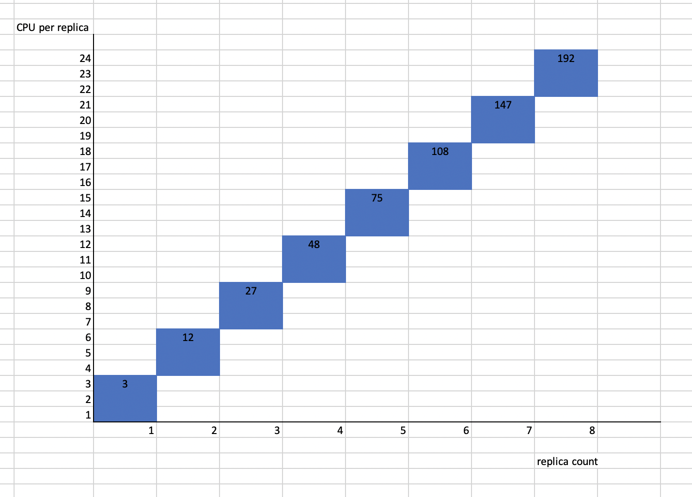

# HVPA-EP-0001: HVPA Redesign

## Summary
This proposal outlines a plan to enable HVPA to do more efficient scaling horizontally and vertically.

## Motivation
Currently, HVPA scales by applying user provided weights to HPA and VPA recommendations. However, if 100% weight is provided to VPA, then horizontal scaling will never happen.
The motivation behind this proposal is to enable users to provide the conditions, and the type of scaling for their applications under those conditions.

### Goals

1. HVPA should be able to scale an application as per the specifications provided by the users

## Proposal

Users will provide buckets of resources each of which would include minimum and maximum CPU, memory and replicas respectively. A configuration is said to belong to a bucket if total resources allocated to all its replcas lie in that bucket. For eg. if their are 3 replicas with 4 cores each, i.e., total 12 cores, then this configuration could belong to a bucket with:
```
minimum CPU: 3
maximum CPU: 6
minimum memory: 2.5G
maximum memory: 7G
minimum replicas: 2
maximum replicas: 5
```
For this bucket mimimum and maximum total CPU are 6 (= 3 * 2) and 30 (= 6 * 5) respectively, and same for the memory would be 5G and 35G respectively.
So a configuration with 3 replicas with 6GB memory each would also lie in the same bucket.

HVPA controller would calculate the total memory and CPU recommended by the recommenders (eg. HPA or VPA) by multiplying pod resources and the number of replicas, and would find the bucket for the calculated total resources. HVPA controller would then divide the bucket linearly to calculate the actual `replicas` and `resources` to which it will scale the application such that the total allocated resources to all its replicas is same as recommeded by the recommenders.

### User Stories (optional)

<!--
Detail the things that people will be able to do if this KEP is implemented.
Include as much detail as possible so that people can understand the "how" of
the system.  The goal here is to make this feel real for users without getting
bogged down.
-->

#### Story 1
A user wants to scale both horizontally and vertically with folloing constraints:
1. minimum replicas: 1, maximum replicas: 8
1. minimum memory: 500M, maximum memory: 25G
1. mimimum CPU: 0m, maximum CPU: 24000m

The above requirement can be denoted as a single bucket.
HVPA controller would divide the "CPU sub-bucket" and the "memory sub-bucket" linearly among the replica counts such that:
1. each CPU bucket is of same size, ie, `3000m`
1. each memory bucket is of same size, ie, `(10G - 100M) / 8`or `1.18G`

Following is an image describing the divided CPU bucket. The numbers in the shaded boxes denote the maximum total resources that can be allocated for a replica count.


HVPA controller will take the total cpu and memory resources recommended by HPA or VPA, and will scale the application both horizontally and vertically such that:
1. the total resoureces allocated to application is same as that recommended by HPA or VPA
1. the total allocated resource is not more than the maximum total resource for that replica count. This way the resource per replica can be capped to a certain maximum value

For example: If an application is running with 2 replicas with 6 cores each, and VPA and HPA recommendations are 12 cores and 4 replicas respectively, then HVPA would scale the application to 3 replicas and 8 cores. This is because both HPA and VPA recommend 24 cores, and this total lies in the 3rd column of 3 replicas. 

#### Story 2
A user wants to scale his/her application such that:
1. It scales only vertically with 1 replica till it reaches 1 core and 2GB memory
1. When more than 2GB memory is required, then the application should be scaled horizontally and vertically till memory reaches 20GB, and CPU reaches 9 cores, until maximum replica count of 8.

In this case, user can provide 2 buckets:
1. First bucket:
   * Replicas: minimum: 1, maximum: 1
   * CPU: minimum: 0, maximum: 1000m
   * Memory: minimum: 0, maximum: 2G
1. Second bucket:
   * Replicas: minimum: 2, maximum: 8
   * CPU: minimum: 1, maximum: 9000m
   * Memory: minimum: 2G, maximum: 20G

### Notes/Constraints/Caveats

#### Different recommendations from HPA and VPA
In such a case, higher recommendations will be used to calculate the desired replica count. This replica count would be used to calculate desired replica size.

#### Different replica count from total CPU and total memory recommendations
In such a case, higher replica count would be taken as the desired count. Desired memory and CPU per replica would be calculated by dividing desired total memory and total CPU by the chosen replica count respectively.

#### Pod with multiple containers
In such a case, all the calculations would be done using the total CPU and total memory allocated to all the containers in the pod for which VPA container resource policy is set to "Auto". The total recommended CPU and memory per replica would then be divided in the same proportion as the recommendations by VPA for those containers.

#### User wants to scale only horizontally (TBD)
<!-- TODO
In such cases, users can define buckets as shown in following example:
For example, if a user wants to scale only horizontally after reaching 4 replicas, and CPU and memory reaching 8 cores and 20GB respectively, the user can define multiple buckets as following:
1. bucket 1
   * Replicas: minimum: 1, maximum: 3
   * CPU: minimum: 0, maximum: 8000m
   * Memory: minimum: 0, maximum: 20GB
1. bucket 2
   * Replicas: minimum: 4, maximum: 6
   * CPU: minimum: 8000m, maximum: 8000m
   * Memory: minimum: 20G, maximum: 20G
-->

<!--
What are the caveats to the proposal?
What are some important details that didn't come across above.
Go in to as much detail as necessary here.
This might be a good place to talk about core concepts and how they relate.
-->

### Risks and Mitigations

#### Base usage of each replica
Each replica of the application is going to have a base usage. When VPA provides higher recommendations, it includes additional resources required for additional workload. This is because VPA does not consider change in the number of replicas. However, if HVPA ends up scaling horizontally because the aggregated resources lie in a bucket with higher number of replicas, then not all of the additional resources would be available to the actual workload. Some of the resources would be accounted to the base usage of new replicas.

**Example** - Consider a situation where each of the 2 replicas of an application running with 5GB memory has a base memory usage of 2GB because of caching, and the VPA memory recommendations are 6GB. Here the total recommended memory is 12GB. If, according to linearly divided bucket, HVPA needs to scale the applications to 3 replicas, then each replica would be just 4GB so that the total memory allocated to the application is set to 12GB. The memory available after deducting the base usage of all replicas would then be 6GB which is same as before the scaling.

*Mitigation* - HVPA would scale the application to 3 replicas of size 6GB each. The total allocated memory would be 18GB, erring on side of stability rather than the cost.

As a general rule of thumb, HVPA will set the size of each replica to the max of the actual VPA recommendation and the desired resources calculated as per bucket strategy.

#### HPA domination
HPA is a more macroscopic autoscaler than VPA, because HPA recommeds change in replicas while VPA recommends change in resources. Because of this, total CPU/memory resources recommended by HPA might tend to dominate under increasing load.

*Mitigation* - Either do not use HPA by setting `.spec.hpa.deploy` to `false` , or set the threshold percentages for HPA accordingly, eg - above 100%

## Design Details

<!--
This section should contain enough information that the specifics of your
change are understandable.  This may include API specs (though not always
required) or even code snippets.  If there's any ambiguity about HOW your
proposal will be implemented, this is the place to discuss them.
-->
A user can provide an array of buckets described above in the [proposal](##proposal).

## Implementation History

<!--
Major milestones in the life cycle of a KEP should be tracked in this section.
Major milestones might include
- the `Summary` and `Motivation` sections being merged signaling SIG acceptance
- the `Proposal` section being merged signaling agreement on a proposed design
- the date implementation started
- the first Kubernetes release where an initial version of the KEP was available
- the version of Kubernetes where the KEP graduated to general availability
- when the KEP was retired or superseded
-->

## Drawbacks

<!--
Why should this KEP _not_ be implemented?
-->

## Alternatives

<!--
What other approaches did you consider and why did you rule them out?  These do
not need to be as detailed as the proposal, but should include enough
information to express the idea and why it was not acceptable.
-->

