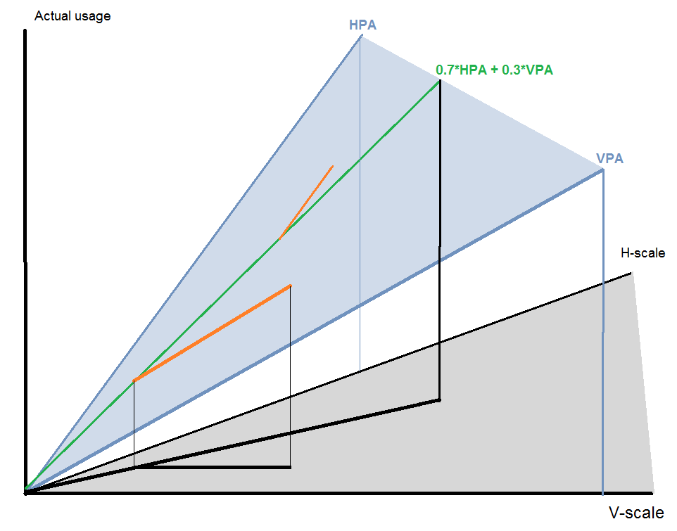

# Known Issues in HVPA Behaviour
HVPA strives to achieve a linear combination of HPA's and VPA's scaling policies: 
`HvpaRecommendedCapacity = k * HpaRecommendedCapacity + (1 - k) * VpaRecommendedCapacity` 
However, due to technical factors discussed below, it is not possible to fulfil this goal. At different
points in time, HVPA ends up mixing horizontal and vertical scaling in proportion which arbitrarily varies in the
entire range between horizontal-only scaling and vertical-only scaling.

## Algorithmic limitation: fusing the behavior of two blackbox systems
There is a nonobvious obstacle before the intent to fuse HPA and VPA behavior in a pre-selected proportion:
Both HPA and VPA's policies are practically unavailable -
HVPA does not know how HPA/VPA would scale the workload, as function of circumstances. The only information available
is "how would HPA/VPA change the existing workload right now". So, in place of the original intent, HVPA resorts to:
`dHvpaRecommendedCapacity = k * dHpaRecommendedCapacity + (1 - k) * dVpaRecommendedCapacity` (the 'd' symbols stand for
"rate of change").

Had HPA and VPA recommendations been always deterministically available, up to date, and with absolute accuracy,
that would result in the originally intended behavior. Simply put, in a 3-D space where one coordinate is the real-world
utilization data, and the other two are the horizontal and vertical scale suggested by the recommender, this is a line -
a line which is a weighted average of the two lines which are individual HPA and VPA recommendations (Fig. 1).

_Fig. 1: HVPA policy as a weighted average of HPA and VPA policies. HPA and VPA policies in blue. HVPA intended policy
in green lies in the plane defined by HPA and VPA. In orange, a vertical-only and
horizontal-only scaling events, leading to deviation from the intended policy._

In practice though, while the HPA and VPA
abstract algorithms are deterministic, **when** they will be applied is not. At any point of the original "line", there
is a race between HPA and VPA, who will act first. If either HPA or VPA manages to act first, the line gets pulled only
in the direction of the horizontal or vertical scale axis. Not only is this new point not on the intended line, but this
new state feeds back into HPA and VPA's decisions, further influencing them. It is noteworthy that there is no force
acting toward convergence to the original line, because once a single-axis scaling event occurs, it alleviates the
pressure to scale on the other axis.

To illustrate the above, if VPA is slow, it is possible for the horizontal scale to reach its allowed maximum, with
vertical scaling never occurring.

In result, instead of a line in said space, the behavior of HVPA corresponds to an entire 2-D surface. For any value of
the actual workload resource consumption, there are multiple combinations of horizontal vs. vertical scale, which HVPA
would recommend, and the choice among these is accidental. Furthermore,
HPA and VPA do not act in accord, and when driven by the same input metrics, as is the case with
HVPA, they have different scaling trigger threshold levels. The mutual relation between these levels is entirely
accidental. Similarly, the resulting autoscaler lacks joint hysteresis behavior, and instead applies hysteresis
separately on the horizontal and vertical scaling axis, on arbitrarily aligned levels.

The cumulative result is that HVPA's recommendations have intrinsic uncertainty between the choice of horizontal vs.
vertical scaling, and a unique risk of oscillating on closed contours on the aforementioned 2-D surface, circumventing
hysteresis thresholds, and arbitrarily trading horizontal for vertical scale and vice versa.

  
Example: extreme single axis scaling (click to expand)

    As example of extreme single axis scaling, consider the following. A workload with constant memory consumption is
    being scaled by a HVPA configured at 50% HPA + 50% VPA, starting at 1 replica with 1 core. The expectation is that
    HVPA will maintain the number of replicas approximately equal to the number of cores per replica. Consider the
    following sequence of events, as CPU demand increases:
    1. CPU usage starts at 0.7 cores. HVPA is stable at 1 replica, 1 core
    2. CPU usage increases to 1.5 cores. HPA acts first, recommending 2 replicas, a change of +1. 50% of +1 is +0.5 replicas,
       rounded up to +1. HVPA applies +1 replica. The workload is now at Consumption=1.5,Replicas=2,CoresPerReplica=1
    3. VPA acts, but does not recommend upscaling because CPU is currently over-provisioned. It does not recommend
       downscaling because MinAllowed is 1 core.
    4. CPU usage increases to 2.1 cores. HPA acts first, recommending 3 replicas, a change of +1. HVPA applies
       2 + ceil(50% * +1) = 3 replicas. The workload is now at Consumption=2.1,Replicas=3,CoresPerReplica=1
    ...and so on. HVPA acts as 100% HPA + 0% VPA, instead of the configured 50%/50%.

## HVPA stuck in unintended stable equilibrium due to feedback of non-deterministic "replica count" signal
HVPA is organized around a concept of multiple scaling stages, where each stage has a different quotient for mixing
HPA and VPA recommendations, and the choice of stage is determined by the number of replicas. The intent is to achieve
a "horizontal first" or "vertical first" type of behavior. The proper functioning of this behavior relies on HVPA
decremental scaling returning on approximately the same trajectory, which is followed during incremental scaling.
However, due to the intrinsic uncertainty between the choice of horizontal vs. vertical scaling, this is not the case.
For example, workloads with "horizontal first" HVPA, which applies only HPA recommendations at low replica counts,
have been occasionally observed to grow to a large number of large replicas, then to reduce the number of replicas
before they have been downscaled vertically, and to end up in the low replica count, "horizontal first" stage, where
vertical scaling is not applied, with large replica(s), preserving large idle pods indefinitely.

## Maintaining inactive code
As a mitigation of the horizontal vs. vertical scaling uncertainty, it is currently prescribed that HVPA only be used
with weight coefficient (`k` in above formulae) of `100%` or `0%`. As far as HVPA core logic for fusing HPA and VPA is
concerned, that renders HVPA functionally equivalent to a much simpler implementation, reducing said core logic to
nothing more than unnecessary maintenance burden.

## Inefficiency induced by initial horizontal-only scaling stage
Kube-apiserver is currently scaled with HVPA strategy where the early stage is HPA-only and that stage results in an
excessive number of small replicas. VPA is unused until the number of replicas reaches the specified maximum,
and replicas retain their initial, minimal size. Kube-apiserver has low compute efficiency in that mode. As a mitigation,
a `ScalingClass` heuristic estimate is applied, to predict the overall kube-apiserver load for the cluster and set a
better, but still fixed, initial replica size. However, while this substantially improves efficiency, it is still less
efficient than using VPA, as it is impossible for a single, fixed value to match the computing resource needs of a given
cluster at all times, let alone of all clusters in the scaling class, at all times.

## 'MinChange' stabilisation prevents response to node CPU exhaustion
There is a known caveat in the current HVPA design, independent of what was discussed above, which has infrequent but
severe impact on system stability:
The vertical scaling stabilization algorithm used by HVPA revolves around a 'MinChange' concept, essentially suppressing
vertical scaling until the recommendation differs from the current allocation (request) by said amount.
Alone, this concept is functionally incorrect when applied to scale-up: scaling is suppressed in a state where VPA is
indicating that the workload is starving for resources. To mitigate this problem, the existing design relies on
resource headroom existing on the node, which can temporarily accommodate the starving workload's needs. In the field,
this approach has been repeatedly observed to cause problems for etcd, for which a particularly high value of MinChange
is used, as frequent evictions are highly undesirable. As an illustration, take a pod with MinChange for CPU set to
1000 millicores, current CPU request at X millicores, actual pod need at X+2000, and available node headroom at 500.
What happens is that actual pod usage extends as far as headroom allows, reaching X+500 and is starving for extra 1500
millicores. Based on pod usage at X+500, VPA recommends e.g. X+900. This recommendation is below the MinChange threshold
of X+1000. HVPA does not act, and the pod is permanently stuck starving for 1500 millicores of CPU.

## HPA-VPA policy fusion model does not account for multiplicative interaction
Lastly, HVPA applies an additive model to the interaction between HPA and VPA, with respect to provided computing power, but
that interaction is actually multiplicative. As an extreme example, take a workload running at one replica with one core.
Then consumption changes to 5 cores, leading HPA to recommend 5 single-core replicas - a change of +4 replicas. VPA
suggests adding 4 cores to the existing single replica. A HVPA configured at 50% HPA + 50% VPA, would apply half of
each recommendation, +2 cores and +2 replicas, resulting in (1 + 2) replicas * (1 + 2) cores. Failing to account for
the multiplicative interaction between changes, HVPA provides a total of 9 cores to a workload which only needs 5. 
