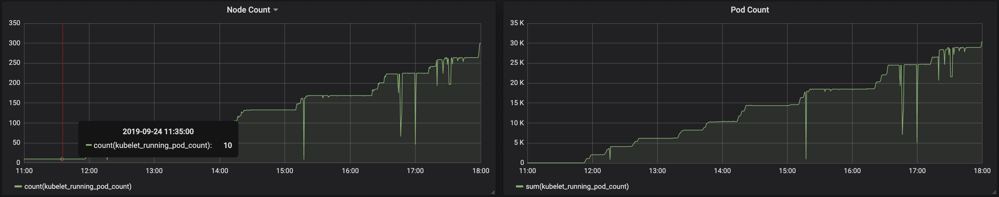

# Performance test of HVPA to scale a Kubernetes Cluster to >220 nodes
## Description

A round of HVPA test was triggered with HPA and VPA on kube-apiserver (via HVPA) and VPA on ETCD (via HVPA) and VPA for the rest of the control-plane components.

## Contents
* [Performance test of HVPA to scale a Kubernetes Cluster to &gt;220 nodes](#performance-test-of-hvpa-to-scale-a-kubernetes-cluster-to-220-nodes)
  * [Description](#description)
  * [Contents](#contents)
  * [Infra Setup:](#infra-setup)
  * [Limits and Requests of All Control Plane Components](#limits-and-requests-of-all-control-plane-components)
  * [Prerequisites-](#prerequisites-)
  * [Events :](#events-)
    * [Observations:](#observations)
  * [Analysis](#analysis)
     * [Summary](#summary)
       * [Next steps](#next-steps)
     * [Detailed Analysis](#detailed-analysis)
        * [Node vs. Pod scaling](#node-vs-pod-scaling)
        * [Resource usage by component](#resource-usage-by-component)
        * [kube-apiserver](#kube-apiserver)
          * [Connectivity during control-plane scaling](#connectivity-during-control-plane-scaling)
          * [Horizontal scaling](#horizontal-scaling)
          * [Vertical scaling](#vertical-scaling)
        * [etcd-main](#etcd-main)
          * [Overview](#overview)
          * [Vertical scaling](#vertical-scaling-1)
        * [etcd-events](#etcd-events)
          * [Overview](#overview-1)
          * [Vertical scaling](#vertical-scaling-2)
        * [kube-controller-manager](#kube-controller-manager)
        * [kube-scheduler](#kube-scheduler)
        * [machine-controller-manager](#machine-controller-manager)
        * [cluster-autoscaler](#cluster-autoscaler)

## Infra Setup:
1. The setup was based on the following PRs
   * [WIP] Integrating hvpa-controller into Gardener -> https://github.com/gardener/gardener/pull/1421
   * Update policy for HVPA -> https://github.com/gardener/hvpa-controller/issues/13
   * Streamline status of HVPA -> https://github.com/gardener/hvpa-controller/issues/14
   * Two-level metrics for HVPA -> https://github.com/gardener/hvpa-controller/issues/15

1. Initial worker node : 10
1. Node type : n1-standard-1 (1c CPU, 3.75Gi Mem)
1. Maximum nodes it can reach : 500.
1. ETCD:          
     * VPA via HVPA with update mode `ScaleUp`
       * MinChange
         * CPU: 1
         * Memory: 2G
         * Stabilization Duration: 5m
       * VPA Recommender ETCD sarting Target: 300mc, 1.049gb
       * Initial ETCD-Main Reqs: 500mc, 1.049mb
     * HPA `Off`
     * Limits
       * CPU: 4c   
       * Mem: 30GB
1. Apiserver:  
     * HPA via HVPA with update mode `Auto`
       * MaxReplicas: 4
     * VPA via HVPA with update mode `ScaleUp`
       * MinChange
         * CPU: 300m
         * Memory: 200M
       * Stabilization Duration: 3m
       * VPA Recommender Apiserver starting Target: 400mc, 400mb
     * Limits
       * CPU:  8c    
       * Mem: 25G
1. Pod Configuration: Busybox with configmaps and secrets mounted each of 1kb
1. Reconciliation Enabled on the shoot

 
## Limits and Requests of All Control Plane Components

```sh
Name                          Limits
cloud-controller-manager     map[cpu:500m memory:512Mi]
cluster-autoscaler           map[cpu:1 memory:3000Mi]
dependency-watchdog          map[cpu:50m memory:128Mi]
gardener-resource-manager    map[cpu:400m memory:512Mi]
grafana-operators            map[cpu:200m memory:128Mi]
grafana-users                map[cpu:200m memory:128Mi]
kube-apiserver               map[cpu:10 memory:30G],map[cpu:1k memory:2G],map[cpu:1 memory:2000Mi]
kube-controller-manager      map[cpu:1500m memory:1500Mi]
kube-scheduler               map[cpu:1500m memory:1500Mi]
kube-state-metrics           <none>
kube-state-metrics-seed      <none>
machine-controller-manager   map[cpu:3 memory:3000Mi]

Name           Limits
etcd-events   map[cpu:2500m memory:20Gi],map[cpu:1 memory:10G]
etcd-main     map[cpu:4 memory:30G],map[cpu:1 memory:10G]
prometheus    map[cpu:300m memory:512Mi],map[cpu:50m memory:128Mi],map[cpu:10m memory:20Mi]
```   

## Prerequisites-
1. Images based on https://github.com/gardener/gardener/pull/1421

**Shoot :** [abcd](https://gardener.ingress.perfteam.gcp.sapcloud.io/namespace/garden-core/shoots/abcd)

## Events :
**Following events occurred during 7hrs of test excution**
```
1. During scale up of 10nodes, KCM new pod came up
     CPU: changed from 120mc->2c
     Mem : 128mb->14.81gb
     Even though target values didn’t change
     Target : (35mc, 78mb); Usage: (22mc,70mb)
     Changed the values to lower nos but GCM reconciled it back to higher values
     Continuing tests with KCM higher limits
2. VPA updater has erros- E0924 04:14:56.917530  1 reflector.go:126] k8s.io/client-go/informers/factory.go:133: Failed to list *v1.LimitRange:  limitranges is forbidden: User "system:serviceaccount:garden:vpa-updater" cannot list resource "limitranges" in API group "" at the cluster scope </br>
     a. Cannot run test with lastest VPA, so have to revert it back to 0.5.0 </br>
     b. MCM limits should be changed to higher values
    "gcp-machine-controller-manager {\"limits\":{\"cpu\":\"3\",\"memory\":\"3000Mi\"},\"requests\": {\"cpu\":\"50m\",\"memory\":\"64Mi\"}}
3. At 1000pods HPA happened
      1pods->2pods
4. At 28th nodes another HPA happened
      2pods-> 3pods
5. At 37th node HPA
      3pods->4pods
*** No VPAs till here ***
*** Reason for no VPA- VPA weight wasn't changed to 0 & 100 but had older values 0 &1 ***
6. At 90th node VPA on apiserver
      VPA on Mem: 839mb->1.55gb
7. At 94th node VPA on apiserver
      VPA on mem: 1.55gb->1.837gb
      VPA on Mem: 1.837gb->2.68GB
8. At 126th node VPA on apiserver
      VPA on mem: 2.68gb->2.976gb
9. At 132th node VPA on apiserver
      VPA on mem: 2.976gb->4.507gb
10. At 170th node VPA on apiserver
      VPA on CPU: 800mc->1.10k
      VPA on Mem: 4.5gb->4.99gb
      VPA on Mem: 4.99gb->6.43gb
11. At 170th node VPA on etcd
      VPA on Mem: 1.049gb->2.976gb (time 15:34pm)
      VPA on Mem: 2.976gb->6.435gb(time 15:39pm)
12. At 170th node VPA on apisever
      VPA on mem: 6.43gb->6.77g, time 15:40
      VPA on mem: 6.77gb->10.63gb, time: 15:43:30
13. At 170th node VPA on apiserver
      VPA on CPU: 1.10c->1.47c , time: 16:03:15
14. At 223th node VPA on apiserver
      VPA on CPU: 1.47c->1.8c
      VPA on Mem: 10.63gb->11.17gb
15. At 225th node VPA on apiserver
      VPA on mem: 11.17gb->12.34gb, time: 16:45:30
      VPA on CPU: 1.8c->2.16c, time: 16:52:00
16. At 240th node VPA on apiserver
      VPA on CPU: 2.16c->2.54c, time: 17:13
*** apiserver connectivity is 0***
17. At 260th node VPA on apiserver
      VPA on Mem: 12.34gb->12.97gb
*** CPC went into CrashLoopBackOff***
18. At 264th Node VPA on Apiserver
      VPA on Mem: 12.97gb->13.63gb, time: 17:32
      VPA on Mem: 13.63gb->15.81gb->17.45gb->18.34gb,  time: 17:50:15
      VPA on CPU: 2.54c->2.98c
```

### Observations:

1. After 264node All the control Plane components failing, status- CrashloopBackoff
Error: Liveness probe failed
1. Cluster Status Nodes=264 Pods=35k Total; Pending Pods=6608
Configmpas=47215; Secrets=41229
1. Thrice KCM pod was created with new reqs, with folllowing changes-
CPU 120mc->2c, 2c->109mc at 17:37 pm
Mem : 128mb->14.81gb, 14.81gb->1.17gb at 17:37pm
## Analysis

### Summary

* Almost all the reported control-plane connectivity downtimes before the instability at > 260 nodes was due to VPA scaling of etcd.
* The control-plane downtimes due to etcd VPA scaling was ~1m.
* Steps to recover the control-plane from the catastrophic failure
  * After scaling kube-apiserver to 10 CPU and 6 replicas the control-plane and the cluster became healthy by itself.
  * With etcd scaled to 30G, it could support 8 kube-apiserver replicas of 15G.

### Detailed Analysis

#### Node vs. Pod scaling



Scaling continued without major disruption until ~240 nodes at 17:10 and then scaling of `kube-apiserver` and `etcd` started becoming disruptive.

#### Resource usage by component


The above graph shows a comparison of resource usage (CPU and memory) by containers. The comparison if container to container by maximum of the resource usage by any of the replicas of that component.

The top three containers by resource usage are `kube-apiserver`, `prometheus` and `etcd` in that order (for both CPU and memory).

#### kube-apiserver

##### Connectivity during control-plane scaling


Scaling continued without major disruption until ~240 nodes at 17:10 and then scaling of `kube-apiserver` and `etcd` started becoming disruptive.

##### Horizontal scaling


The horizontal scaling of `kube-apiserver` was manged by HVPA with more `Auto`. I.e. HVPA allowed HPA to scale till `maxReplicas` were reached and only then started vertical scaling.

Initially, all the scaling is horizontal until it is scaled to 4 replicas around 12:15. All the rest of the scaling is vertical.

##### Vertical scaling


As can be seen above, there were multiple vertical scalings of `kube-apiserver` after 12:15 almost all of which were non-disruptive until 17:10.

#### etcd-main

##### Overview


##### Vertical scaling


As can be seen above, `etcd-main` was memory-bound.

The vertical scaling of `etcd` was controlled via HVPA.

There were back-to-back scaling around 15:43 and 15:39 stabilized by the scale-up stabilization duration. Both these scaling caused a disruption of <90s. Later scaling after 17:10 with >240 nodes caused longer and more uncontrolled disruptions.

#### etcd-events

##### Overview


##### Vertical scaling


There was no scaling required for `etcd-events`.

#### kube-controller-manager


Scaling of `kube-controller-manager` was not required because of the very high resources allocated to it initially.
Unsure from where such high resource requests were set.

#### kube-scheduler


`kube-scheduler` was directly scaled by VPA in `Auto` mode.
The CPU usage was directly related to the burst of new pods to be scheduler whereas memory usage was proportional to the number of pods.

#### machine-controller-manager


`machine-controller-manager` seems to be CPU-bound. But the scaling seems to be sub-linear. However, there seems to be some scope for optimization here.

#### cluster-autoscaler


VPA was not enabled for `cluster-autoscaler`. Based on the resource usage shown above, it seems to be mainly memory-bound but also to a lesser extent CPU-bound. So, it makes sense to enable VPA for `cluster-autoscaler`.
