# HVPA-EP-0001: HVPA Redesign

## Summary

At present, HVPA controls only the vertical scaling. Horizontal scaling is completely under the control of HPA.
This can lead to inefficient (e.g. too much horizontal scale at the lower end of the scale) and unpredictable scaling (because HPA is free to apply its recommendations) of the target components.
This proposal describes an approach to enable HVPA user to specify control over both vertical and horizontal scaling to achieve more efficient and predictable scaling behaviour for the target components.

## Content

- [HVPA-EP-0001: HVPA Redesign](#hvpa-ep-0001-hvpa-redesign)
  - [Summary](#summary)
  - [Content](#content)
  - [Motivation](#motivation)
     - [Context](#context)
     - [HPA Caveat](#hpa-caveat)
     - [Problems](#problems)
        - [Too many small replicas at the lower end of the scale](#too-many-small-replicas-at-the-lower-end-of-the-scale)
        - [Unpredictable scaling behaviour with 0 &lt; vpaWeight &lt; 100](#unpredictable-scaling-behaviour-with-0--vpaweight--100)
        - [Thrashing of scaling near the boundary between adjacent scaling intervals](#thrashing-of-scaling-near-the-boundary-between-adjacent-scaling-intervals)
  - [Goals](#goals)
     - [Achieve appropriate vertical scale for any given horizontal scale](#achieve-appropriate-vertical-scale-for-any-given-horizontal-scale)
     - [Achieve consistent scaling behaviour (per scaling direction) that is independent of the sequence of HPA and VPA recommendations](#achieve-consistent-scaling-behaviour-per-scaling-direction-that-is-independent-of-the-sequence-of-hpa-and-vpa-recommendations)
     - [Differential scaling near the boundary between adjacent scaling intervals](#differential-scaling-near-the-boundary-between-adjacent-scaling-intervals)
  - [Non-goals](#non-goals)
  - [Approach](#approach)
     - [Scaling intervals based on total resource recommendation](#scaling-intervals-based-on-total-resource-recommendation)
        - [Total resource recommendation](#total-resource-recommendation)
     - [Effective Scaling Interval](#effective-scaling-interval)
        - [Example](#example)
     - [Challenges](#challenges)
        - [Paradoxical vertical scaling around the boundary between effective scaling intervals](#paradoxical-vertical-scaling-around-the-boundary-between-effective-scaling-intervals)
           - [Scaling only vertically or horizontally if the adjusted recommended resources implies vertical scaling per pod in a direction opposite to that of the total resource recommendation](#scaling-only-vertically-or-horizontally-if-the-adjusted-recommended-resources-implies-vertical-scaling-per-pod-in-a-direction-opposite-to-that-of-the-total-resource-recommendation)
        - [Base resource usage per replica](#base-resource-usage-per-replica)
           - [Use the already proposed hysteresis between scaling up and scaling down](#use-the-already-proposed-hysteresis-between-scaling-up-and-scaling-down)
           - [Use explicitly specified base resource usage in the calculations](#use-explicitly-specified-base-resource-usage-in-the-calculations)
           - [Use the higher value among full VPA recommendation and adjusted recommendation per pod based on the effective scaling interval](#use-the-higher-value-among-full-vpa-recommendation-and-adjusted-recommendation-per-pod-based-on-the-effective-scaling-interval)
        - [Multiple sources of resource recommendation](#multiple-sources-of-resource-recommendation)
           - [Single source](#single-source)
           - [Multiple sources](#multiple-sources)
        - [Multiple resources](#multiple-resources)
        - [Multiple containers in the target component pods](#multiple-containers-in-the-target-component-pods)
           - [Sum of the recommendations for a resource for all the containers as total recommendation for the resource](#sum-of-the-recommendations-for-a-resource-for-all-the-containers-as-total-recommendation-for-the-resource)
           - [Maximum of the desiredReplicas based on the total resource recommendation for each of the containers](#maximum-of-the-desiredreplicas-based-on-the-total-resource-recommendation-for-each-of-the-containers)
        - [Multiple containers with some containers with VPA ContainerScalingMode Off](#multiple-containers-with-some-containers-with-vpa-containerscalingmode-off)
        - [Interaction with other existing HVPA functionality](#interaction-with-other-existing-hvpa-functionality)
           - [Deploy](#deploy)
           - [ScaleType](#scaletype)
           - [MaintenanceWindow](#maintenancewindow)
           - [MinChange](#minchange)
           - [LimitsRequestsGapScaleParams](#limitsrequestsgapscaleparams)
        - [Hysteresis to avoid thrashing of scaling near the boundary between adjacent scaling intervals](#hysteresis-to-avoid-thrashing-of-scaling-near-the-boundary-between-adjacent-scaling-intervals)
           - [ScalingIntervalsOverlap](#scalingintervalsoverlap)
           - [ScaleDownMinResource](#scaledownminresource)
        - [VPA Scale-down Efficiency and Responsiveness](#vpa-scale-down-efficiency-and-responsiveness)
        - [Scaling only vertically](#scaling-only-vertically)
        - [Scaling only horizontally](#scaling-only-horizontally)
  - [Design](#design)
     - [Replace the field WeightBasedScalingInterval with ScalingInterval](#replace-the-field-weightbasedscalinginterval-with-scalinginterval)
     - [Move LimitsRequestsGapScaleParams from VPASpec into HVPASpec](#move-limitsrequestsgapscaleparams-from-vpaspec-into-hvpaspec)
     - [Move ScaleUp and ScaleDown from HPASpec and VPASpec into HVPASpec](#move-scaleup-and-scaledown-from-hpaspec-and-vpaspec-into-hvpaspec)
     - [Introduce ScalingIntervalsOverlap](#introduce-scalingintervalsoverlap)
     - [EffectiveScalingInterval](#effectivescalinginterval)
     - [Introduce BaseResourcesPerReplica](#introduce-baseresourcesperreplica)
     - [Example](#example-1)
     - [Limitations](#limitations)
        - [Single scaling intervals specification](#single-scaling-intervals-specification)
     - [Implementation Priority](#implementation-priority)
  - [Alternatives](#alternatives)

## Motivation

### Context

HVPA started with the ability to specify different scaling behaviour at different scales of the target component.
This was done by dividing the scale into _buckets_ of [`weightBasedScalingIntervals`](https://github.com/gardener/hvpa-controller/blob/a797cc095c83a8415290cf7ec3319ee31c4078fd/api/v1alpha1/hvpa_types.go#L216) based on contiguous [range](https://github.com/gardener/hvpa-controller/blob/a797cc095c83a8415290cf7ec3319ee31c4078fd/api/v1alpha1/hvpa_types.go#L95-L102) of horizontal replica counts.
The scaling behaviour would then be specifiable via [`vpaWeight`](https://github.com/gardener/hvpa-controller/blob/a797cc095c83a8415290cf7ec3319ee31c4078fd/api/v1alpha1/hvpa_types.go#L94) separately for each such bucket.
Any number of such contiguous buckets of scaling intervals could be defined.
This was to allow flexibility to be able specify different scaling behaviour at different levels of scaling.

However, as mentioned in [#7](https://github.com/gardener/hvpa-controller/issues/7), HVPA only controls the vertical scaling because VPA supports the `updatePolicy` functionality to separate scaling recommendation from the application of it.
HPA doesn't yet support similar functionality. 
Because of this, HVPA allows HPA to apply its recommendations freely and applies vertical scaling only when [horizontal scaling is limited](https://github.com/gardener/hvpa-controller/blob/a797cc095c83a8415290cf7ec3319ee31c4078fd/controllers/hvpa_controller.go#L788-L806).
Due to these constraints, only supported values for `vpaWeight` were [`0`](https://github.com/gardener/hvpa-controller/blob/a797cc095c83a8415290cf7ec3319ee31c4078fd/controllers/hvpa_controller.go#L989) (meaning only horizontal scaling) or [`100`](https://github.com/gardener/hvpa-controller/blob/master/controllers/hvpa_controller.go#L993-L1049) (meaning only vertical scaling).

An example of the above usage can be seen in how it is used for scaling `kube-apiserver` deployment [in gardener](https://github.com/gardener/gardener/blob/6368746e2af01b116ce702d4075ee36a204ea50d/charts/seed-controlplane/charts/kube-apiserver/templates/hvpa.yaml#L81-L89).

```yaml
apiVersion: autoscaling.k8s.io/v1alpha1
kind: Hvpa
...
spec:
...
  weightBasedScalingIntervals:
  - vpaWeight: 0
    startReplicaCount: 1
    lastReplicaCount: 3
  - vpaWeight: 100
    startReplicaCount: 4
    lastReplicaCount: 4
...
```

This means that the target will be scaled only horizontally in the first bucket (`replicas` `1` to `3`) and will be scaled vertically once HPA has scaled the target till `replicas` `4`.

### HPA Caveat

Some of the limitations HPA mentioned in this proposal are based on the version [`v2beta1`](https://kubernetes.io/docs/reference/generated/kubernetes-api/v1.18/#horizontalpodautoscaler-v2beta1-autoscaling).
More flexibility has been introduced into HPA in [`v2beta2`](https://kubernetes.io/docs/reference/generated/kubernetes-api/v1.18/#horizontalpodautoscaler-v2beta2-autoscaling).
But due to some dependencies, HVPA continues to use HPA version `v2beta1`.

### Problems

#### Too many small replicas at the lower end of the scale

The existing approach described [above](#context) can lead to too many small replicas at the lower end of the scale.
This is quite inefficient considering that most horizontally scaling component have a base usage per replica that can be a significant portion of the replica at the lower end of the scale.
This is especially so in the case of `kube-apiserver` which uses a cache to improve performance which adds to the base usage.
Hence, it is desirable to scale vertically earlier.

#### Unpredictable scaling behaviour with `0` < `vpaWeight` < `100`

The initial thinking behind the `weightBasedScalingIntervals` was to eventually support values for `vpaWeight` other than `0` and `100`. For this to work, HPA scaling will have to be controlled.
As mentioned in [#7](https://github.com/gardener/hvpa-controller/issues/7), the recommended approach from the community for controlling HPA scaling was to implement `Scale` sub-resource in HVPA and use the scale sub-resource as a target for HPA scaling (instead of the actual target supplied to HVPA).
This allowed the HVPA itself to act as a buffer between HPA recommendation and HVPA applying the recommendation.
With this approach, if `h1` is the current number of replicas and `v1` is the current requested resource (say, `memory`) per replica, with VPA recommending `v2` for the resource per replica and HPA recommending `h2` `replicas`, `v1 + (v2-v1)*vpaWeight/100` could be applied for the resource per replica and `h1 + (h2-h1)*(1 - vpaWeight/100)` replicas would be applied. I.e. the weight will be applied to the delta between the current values and the recommendations and added to the current values. Some rounding for replicas and corresponding adjustment to the vertical scale to compensate for the rounding will also be required.

This approach leaves the scaling behaviour subject to the way the recommendations are coming from HPA and VPA in a way that is undesirable.

For example, let us consider that HVPA is configured with a single bucket in `weightBasedScalingIntervals` with `vpaWeight: 50` and `maxAllowed` memory of `25Gi` for memory.

```yaml
weightBasedScalingIntervals:
- vpaWeight: 50
  startReplicaCount: 1
  lastReplicaCount: 4
```

If the HPA recommendations come in increments of `1` `replica`, then the following scaling could be seen. For simplicity, no adjustment for vertical scaling to compensate for rounding of horizontal scaling is done.

Variable|Initial Values|Step 1|Step 2|Step 3
---|---|---|---|---
HPA Recommendation|`desiredReplicas: 1`|`desiredReplicas: 2`|`desiredReplicas: 3`|`desiredReplicas: 4`
VPA Recommendation|`memory: 300M`|`memory: 600M`|`memory: 675M`|`memory: 751M`
Applied Scaling|`replicas: 1`<br>`memory: 300M`|`replicas: 2` <sub>1+round((2-1)x0.5</sub><br>`memory: 450M` <sub>300+(600-300)x0.5</sub>|`replicas: 3` <sub>2+round((3-2)x0.5<br>`memory: 563M` <sub>450+(675-450)x0.5</sub>|`replicas: 4` <sub>3+round((4-3)x0.5</sub><br>`memory: 657M` <sub>563+(751-563)x0.5</sub>

If the HPA recommendations come in larger increments, then the following scaling could be seen.

For example, with increments of `2` replicas, the following scaling might happen.

Variable|Initial Values|Step 1|Step 2|Step 3
---|---|---|---|---
HPA Recommendation|`desiredReplicas: 1`|`desiredReplicas: 3`|`desiredReplicas: 4`|`desiredReplicas: 4`
VPA Recommendation|`memory: 300M`|`memory: 900M`|`memory: 1200M`|`memory: 1200M`
Applied Scaling|`replicas: 1`<br>`memory: 300M`|`replicas: 2` <sub>1+round((2-1)x0.5</sub><br>`memory: 600M` <sub>300+(900-300)x0.5</sub>|`replicas: 3` <sub>2+round((4-2)x0.5</sub><br>`memory: 900M` <sub>600+(1200-600)x0.5</sub>|`replicas: 4` <sub>2+round((4-3)x0.5</sub><br>`memory: 1050M` <sub>900+(1200-900)x0.5</sub>


Or with even larger increments of replicas, the following scaling might happen.

Variable|Initial Value|Step1|Step2
---|---|---|---
HPA Recommendation|`desiredReplicas: 1`|`desiredReplicas: 4`|`desiredReplicas: 4`
VPA Recommendation|`memory: 300M`|`memory: 1200M`|`memory: 1000M`
Applied Scaling|`replicas: 1`<br>`memory: 300M`|`replicas: 3` <sub>1+round((4-1)x0.5</sub><br>`memory: 750M` <sub>300+(1200-300)x0.5</sub>|`replicas: 4` <sub>3+round((4-3)x0.5</sub><br>`memory: 875M` <sub>750+(1000-750)x0.5</sub>

As can be seen in the examples above, the scaling behaviour is dependent on the sequence or recommendations even while scaling in only one direction.
Moreover, the effective weight for horizontal scaling could be a lot more than `0.5`.
Different values for `vpaWeight` might achieve different bias for horizontal or vertical scaling but the dependency on the sequence of recommendations would remain.

Similarly, any other way of rounding and adjusting (for example, something favouring VPA a bit more), would still result in similar unpredictable scaling depending on the recommendations coming from HPA and VPA.

But typically, it would be desirable to have the scaling behaviour dependent only on the actual recommendation rather than the sequence of recommendations.
An exception to this principle, would be that a difference in the scaling behaviour during scaling up v/s scaling down might be desirable as seen [below](#thrashing-of-scaling-near-the-boundary-between-adjacent-scaling-intervals).

#### Thrashing of scaling near the boundary between adjacent scaling intervals

If for a target component, the HPA and VPA recommendations happen to fluctuate around a narrow range which happens to be at the boundary of two adjacent scaling intervals, it might so happen that HVPA keeps switching between the adjacent buckets while scaling up and down.
This would be disruptive to the component.
Hence, it would be desirable to have slightly different scaling behaviour while switching scaling interval buckets during a scale up as against during a scale down.
Such a difference (a.k.a hysteresis) would stabilize the scaling behaviour near the boundary between two adjacent scaling intervals.

## Goals

### Achieve appropriate vertical scale for any given horizontal scale

The problem of [too many small replicas](#too-many-small-replicas-at-the-lower-end-of-the-scale) at the lower end of the scale forms a part of the larger problem of inappropriate vertical scale for any given horizontal scale.
It is a goal of this proposal to make it possible to specify and enforce appropriate vertical scale for any given horizontal scale.

### Achieve consistent scaling behaviour (per scaling direction) that is independent of the sequence of HPA and VPA recommendations

It is a goal of this proposal to avoid scaling behaviour that is [dependent](#unpredictable-scaling-behaviour-with-0--vpaweight--100) on the sequence of HPA and VPA recommendations.

### Differential scaling near the boundary between adjacent scaling intervals

It is a goal of this proposal to stabilize [thrashing](#thrashing-of-scaling-near-the-boundary-between-adjacent-scaling-intervals) of scaling near the boundary between adjacent scaling intervals by achieving differential scaling behaviour while scaling up as against while scaling down near the boundary between adjacent scaling intervals.

## Non-goals

- There are some problems with the way HPA and VPA provide recommendations for some scenarios such as handling a sudden substantial spike in resource usage as well as limitations in configurability of their behaviour for scaling up and scaling down.
- It is not a goal of this proposal to improve the way HPA and VPA provide recommendations.
- It is also not a goal of this proposal to come up with alternative sources of scaling recommendations.

## Approach

### Scaling intervals based on total resource recommendation

The approach of `vpaWeight` and configuring scaling interval based on the current horizontal scale (`currentReplicas`) leads to [many](#too-many-small-replicas-at-the-lower-end-of-the-scale) [issues](#unpredictable-scaling-behaviour-with-0--vpaweight--100).
The root causes for these issues can be traced back to the approach of `vpaWeight` and configuring scaling interval based on the current horizontal scale.

However, if both these approaches are discarded in favour of deciding scaling intervals based on the _total resource recommendation_, i.e. `replicas x (resource per replica)`, then the need for `vpaWeight` is eliminated.
This approach also achieves very consistent scaling behaviour that adheres closely to any scaling behaviour specification while also being independent of the sequence of HPA and VPA recommendations.

#### Total resource recommendation

Total resource recommendation for a HPA recommendation is `desiredReplicas x (currently applied resource request per replica)` and for VPA recommendation it is `currentReplicas x (recommended resource recommendation per replica)`.

Effectively, for each scaling interval based on a range in total resource recommendation, there would be a single specified `desiredReplicas` which would be applied. The corresponding range of resource recommendation per replica can automatically computed with something like `{range of total resource recommendation} / desiredReplicas`.

### Effective Scaling Interval

As seen [above](#scaling-intervals-based-on-total-resource-recommendation), the _effective scaling interval_ can be defined as a range of allowed total resource recommendation for each allowed value of `desiredReplicas`.
This way of specifying the range for total resource recommendation for each allowed value of `desiredReplicas` is to allow for maximum flexibility in specifying the desired horizontal and vertical scaling behaviour for the target component because different target components have different scaling requirements at different scale of workload.

However, explicitly specifying the ranges for every allowed value of `desiredReplicas` can be cumbersome. So, the actual specification of the scaling intervals might look different. For example, there might be some short-hand notations to specify multiple scaling intervals at a time. Also, it might be more natural to specify the scaling intervals in terms of resources per replica rather than total resources.
But such short-hand notations will always be translatable to implicit _effective scaling intervals_ for each allowed value of `desiredReplicas` and this proposal will make use of the range of total resource recommendation for every allowed value of `desiredReplicas` as the basis for solving most of the important problems addressed by this proposal.

#### Example

For example, a simplified version of a desirable scaling behaviour for `kube-apiserver` could be as follows.

Replicas|Max vCPU per pod|Max memory (Gi) per pod|Max total vCPU|Max total memory (Gi)
---|---|---|---|---
1|0.5|2|0.5|2
2|1|4|2|8
3|2|8|6|24
4|4|16|16|64
5|8|32|40|160

This specifies a range of vertical scaling per pod at each `replicas` value.

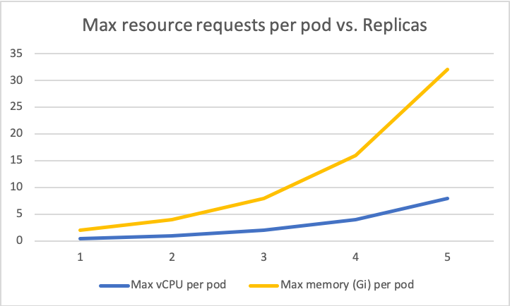

The same information can be seen in a different way that for any particular range of total resources (`(resources per pod) * replicas`), there is a single desired `replicas` value.

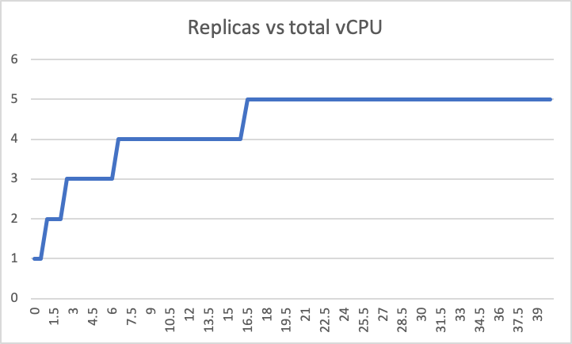
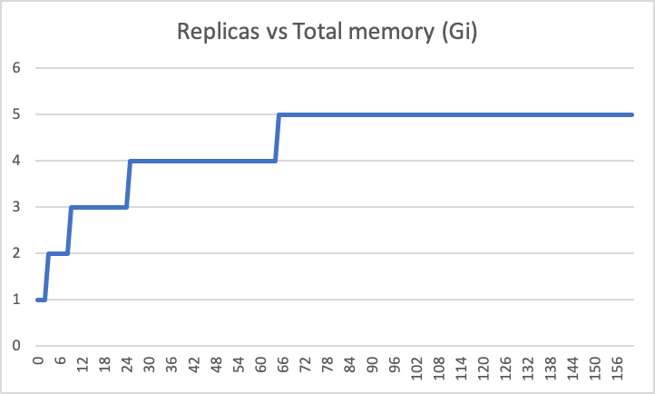

This view gives us a better understanding of how to apply horizontal scaling for given range of recommendations in terms of total resources.
Moreover, the way horizontal scaling is to be applied is now only dependent on the total resources being currently recommended. 

### Challenges

The [proposed approach](#scaling-intervals-based-on-total-resource-recommendation) introduces other challenges while considering base resource usage per replica, multiple resources, multiple containers in the target component pods, multiple sources of recommendations (HPA and VPA), hysteresis to stabilize thrashing near the scaling interval boundaries etc.

#### Paradoxical vertical scaling around the boundary between effective scaling intervals

The [proposed approach](#scaling-intervals-based-on-total-resource-recommendation), assumes that once the `desiredReplicas` is determined based on the total resource recommendation, the corresponding vertical scale can be computed using something like `{range of total resource recommenation} / desiredReplicas`).

In the given [example above](#example), this might be visualized as given below.

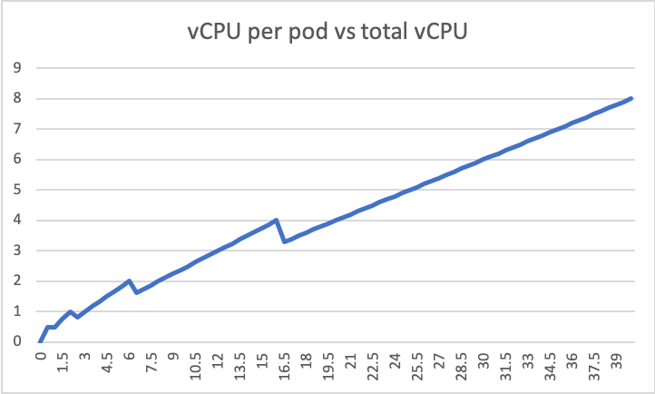
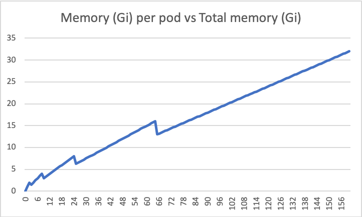

As can be seen above, this would lead to a paradoxical situation around the boundary between the intervals where the `desiredReplicas` change, where we might have to vertically scale down while scaling up overall and vice versa.

This also related to the problem of [thrashing near the boundary between scaling intervals](#thrashing-of-scaling-near-the-boundary-between-adjacent-scaling-intervals).

##### Scaling only vertically or horizontally if the adjusted recommended resources implies vertical scaling per pod in a direction opposite to that of the total resource recommendation

While scaling up, the higher value among the current request per pod and the adjusted recommended request per pod could be applied if the current `replicas`, applied resource requests, scaling intervals and the total resource recommendation are such that the desired `replicas` is different from the current `replicas`.
If the scaling happens within the same `replicas` then only the adjusted recommended request per pod is applied.

The same formula cannot be used while scaling down.
Instead, we could postpone scaling horizontally until the current request per pod is no longer less than the adjusted recommended request per pod for the desired `replicas`.
While scaling down, this has the effect of using the higher value for `replicas` among the current `replicas` an the recommended replicas if the adjusted recommended resource request per pod is less than the current value.

Then the vertical scaling for the [above](#base-resource-usage-per-replica) [example](#example) would look like below.

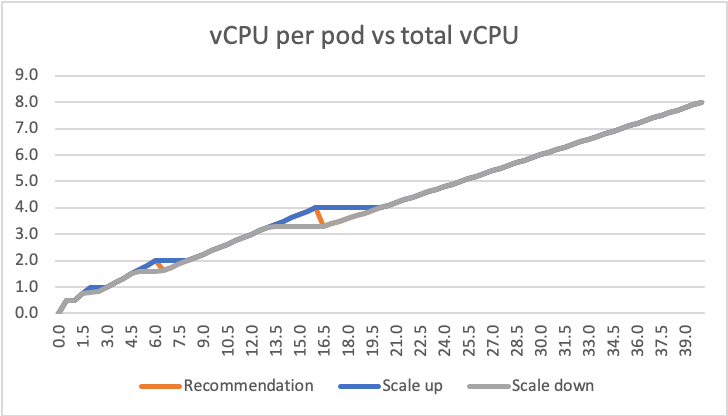
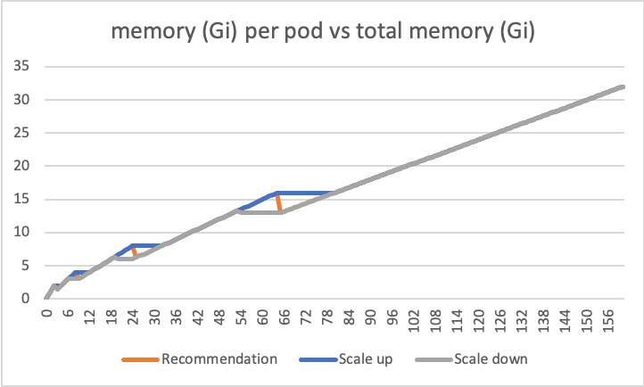

The corresponding horizontal scaling would look like below.

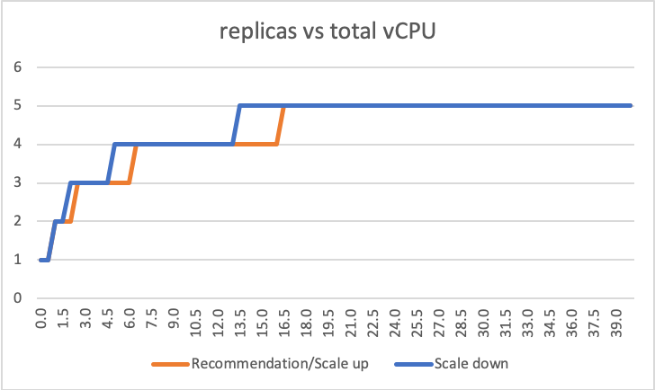
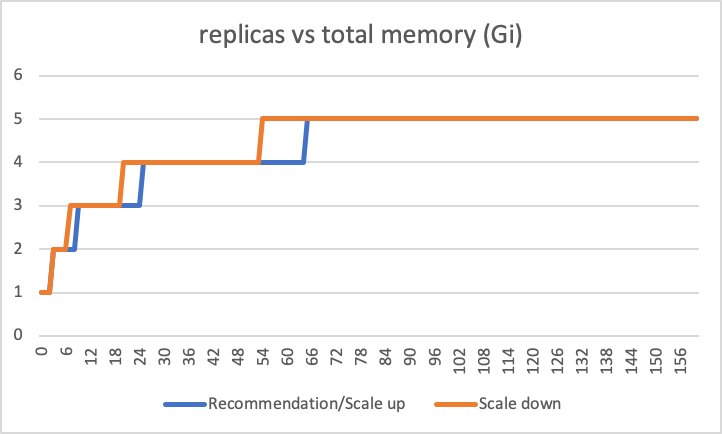

As can be clearly seen above, this introduces a kind of hysteresis between scaling up and scaling down (both vertically and horizontally).
This hysteresis can also be visualized as below.

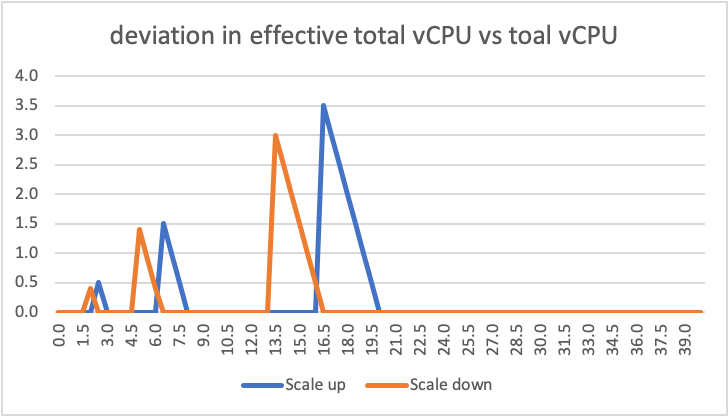
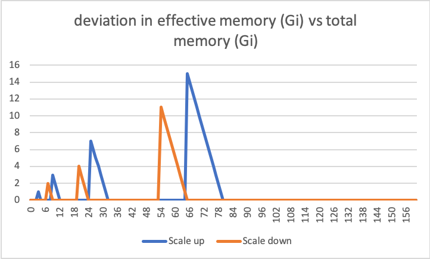

Please note that this hysteresis errs on the side of stability by providing more resource to the component both while scaling up and down horizontally.
Please also note that there is no hysteresis while scaling up and down only vertically.

This hysteresis could also be used as part of the solution to the problem of [thrashing near the boundary between scaling intervals](#thrashing-of-scaling-near-the-boundary-between-adjacent-scaling-intervals).

A disadvantage of this approach is that the additional resources allocated while scaling horizontally is in proportion to the `replicas`.
But since scaling vertically (both up and down) can proceed smoothly as soon as the horizontal scaling is applied, the additional resources should be adjusted by subsequent scaling.

This relies on the fact that VPA can be [tuned and configured](#vpa-scale-down-efficiency-and-responsiveness) to be efficient and responsive, especially while scaling down.


#### Base resource usage per replica

In the [proposed approach](#scaling-intervals-based-on-total-resource-recommendation), it was mentioned that given scaling interval based on the total resource recommendation and the specified `desiredReplicas` for that scaling interval, the corresponding range of resource recommendation per replica can automatically computed with something like `{range of total resource recommendation} / desiredReplicas`.

This statement assumes that, for the target component, scaling horizontally and vertically are equivalent.
However, this is not true for almost all components because each replica has a base resource usage that is not  directly in the service of (and hence in proportion to) the workload.
It the target component is `kube-apiserver`, it caches data to optimize response times and throughput which adds to the base resource usage.

This poses a problem in computing and adjusting the resource recommendation per pod based on the specified `desiredReplicas`.
In other words, there is a need to budget for the additional overall base resource usage while scaling up horizontally and for reduced overall based resource usage during scale down.
Base resource usage is not a concern while scaling only vertically.

There are many ways this can be addressed.

##### Use the already proposed hysteresis between scaling up and scaling down

The [hysteresis](#scaling-only-vertically-or-horizontally-if-the-adjusted-recommended-resources-implies-vertical-scaling-per-pod-in-a-direction-opposite-to-that-of-the-total-resource-recommendation) introduced to address paradoxical vertical scaling in a direction opposite to the direction of scaling of total resources already errs on the side of stability by allocating additional resources while scaling horizontally.
This additional resource might suffice for some components.

A disadvantage of this approach would be that this hysteresis allocates additional resources in proportion to the `replicas` which may not be enough to budget for the base resource usage at the lower end of the total scale.

##### Use explicitly specified base resource usage in the calculations

Base resource usage could be mitigated by explicitly specifying the base resource usage to be used in the calculation to compute the adjusted resource recommendation per replica.
Such base resource usage specification might look like below.

```yaml
apiVersion: autoscaling.k8s.io/v1alpha1
kind: Hvpa
...
spec:
...
  baseResourcesPerReplica:
    cpu:
      value: 50m
      percentage: 5
    memory:
      value: 100M
      percentage: 10
...
```

As can be seen above, the base resources per replica could be specified per resource and both as absolute value as well as a percentage value.
If both absolute and percentage values are specified, the larger effective base resource per replica for the resource will be used in calculating the adjusted recommended resources per replica.
So, the simplistic formula `(total resource recommendation) / desiredReplicas` could be adjusted to
```
(raw total resource recommendation) = (total resource recommendation) - (max(spec.baseResourcesPerReplica[resource].value, (total current resource requests) x spec.baseResourcesPerReplica[resource].percentage / 100) * currentReplicas)

(adjusted vertical resource recommendation per replica) =  (raw total resource recommendation) + max(spec.baseResourcesPerReplica[resource].value, (raw total resource recommendation) x spec.baseResourcesPerReplica[resource].percentage / 100)
```

As already mentioned [above](#base-resource-usage-per-replica), this modified formula (as well as the [hysteresis](#scaling-only-vertically-or-horizontally-if-the-adjusted-recommended-resources-implies-vertical-scaling-per-pod-in-a-direction-opposite-to-that-of-the-total-resource-recommendation)) is to be applied only while scaling horizontally.
Pure vertical scaling doesn't need this.

This approach is viable because for any given component and its usage, the base usage per replica is very likely to be a constant or some direct proportion of the vertical scale.
Also, it is likely to be a significant proportion only at the lower scale (even considering caching) and the absolute value should be configured to adjust for the lower end of the scale while the percentage value addresses the higher end of the scale.

As can be seen from the formula above, not configuring any values for base resource per replica would have the effect not adding anything to account for the base usage for that resource while scaling horizontally.

##### Use the higher value among full VPA recommendation and adjusted recommendation per pod based on the effective scaling interval

Another possibility is to apply the higher value among the full VPA recommendation and the adjusted recommendation per resource based on the [effective scaling interval](#effective-scaling-interval).
Again, this is applicable only while scaling horizontally.

However, this approach very likely over-compensates, especially while scaling up horizontally.
This is because while scaling up horizontally, VPA recommendation is based on `currentReplicas` and already accounts for the total base resource per replica.
So, applying it fully while scaling up is guaranteed to be over-compensation leading to unnecessary cost.

Because of this, this approach is not suggested and a combination of [already proposed hysteresis](#use-the-already-proposed-hysteresis-between-scaling-up-and-scaling-down) and [explicitly specified base resources per replica](#use-explicitly-specified-base-resource-usage-in-the-calculations) is suggested to deal with base resource usage per replica while scaling horizontally.

#### Multiple sources of resource recommendation

The approach described [above](#approach) works well for any source of resource recommendation including HPA and VPA.
Also, it works well with single or multiple such sources of resource recommendation.
I.e. this approach can be used with only HPA or only VPA as the source of resource recommendations.
Also, it works well with both HPA and VPA as multiple sources of resource recommendations.
In principle, this approach would work with any other source of resource recommendation in the future.

In all these cases, this approach describes a way to apply the recommendation both horizontally as well as vertically.
To be specific, currently, this approach can help scale both horizontally as well as vertically based solely on VPA recommendation or solely on HPA recommendation or a combination of both HPA and VPA recommendation.

##### Single source

 As mentioned [above](#multiple-sources-of-resource-recommendation), it is perfectly valid to use this [approach](#approach) with a single source of resource recommendation and hence completely avoid a conflict based on multiple sources of resource recommendation.
 If only one source of resource of recommendation is to be used, in general, VPA might be more preferable because VPA is a more granular (provides container-wise and resource-wise recommendation) and flexible (allows disabling scaling for some containers) source of recommendation, though there is no technical problem with using HPA as the single source of recommendation.

 HPA can be disabled as a source of recommendation by setting `.spec.hpa.deploy` to `false` in the HVPA specification.
 Similarly, VPA can be disable as a source of recommendation by setting `.spec.vpa.deploy` to `false` in the HVPA specification.
 VPA can also be disabled partially for some containers using the [`ContainerScalingMode`](https://github.com/gardener/hvpa-controller/blob/a797cc095c83a8415290cf7ec3319ee31c4078fd/vendor/k8s.io/autoscaler/vertical-pod-autoscaler/pkg/apis/autoscaling.k8s.io/v1beta2/types.go#L141) to `Off` for those containers.

##### Multiple sources

However, when there are multiple sources of recommendation (e.g. HPA and VPA), the actual recommendations from the different sources might be such that the corresponding specified `desiredReplicas` might be different.

In case of such a conflict, the proposal is to pick the higher of the specified `desiredReplicas`.
Here, the trade-off is between stability (more replicas would typically lead to more stability) and cost (less replicas would be cost efficient for multiple reasons including [base resource usage per replica](#base-resource-usage-per-replica)).
The idea is to err on the side of stability (more replicas) vs. cost efficiency (less replicas).

As noted [above](#single-source), VPA is more granular and flexible source of recommendation than HPA.
This has the implication that sometimes, HPA recommendations might come to dominate the VPA recommendations if HPA is configured to give higher recommendations than VPA.
So, care must be taken to configure HPA properly (say, by configuring scaling threshold percentage to be greater than or equal to `100%`) to not dominate or overshadow VPA recommendations consistently.

#### Multiple resources

It is possible that sometimes the recommendations for different resources (CPU and memory) are such that they specify different `desiredReplicas`.

Given the [above example](#example), the following recommendations might conflict in terms of the `desiredReplicas`.

Resource|Total Resource Recommendation|Desired Replicas
---|---|---
cpu|4|3
memory|26|4

When there is such conflict between the specified `desiredReplicas` for different resources, the proposal is to pick the higher of the specified `desiredReplicas`.
The trade-off here is similar to the one in the case [multiple sources of resource recommendation](#multiple-sources-of-resource-recommendation).
Hence, the proposed solution is also the same.

Once the `desiredReplicas` are decided in this way, all the suggestions [mentioned](#scaling-only-vertically-or-horizontally-if-the-adjusted-recommended-resources-implies-vertical-scaling-per-pod-in-a-direction-opposite-to-that-of-the-total-resource-recommendation) [above](#base-resource-usage-per-replica) regarding scaling horizontally would apply to all the resources being scaled vertically.
Again if the `desiredReplicas` decided in this way is equal to the `currentReplicas` then it would be a simple vertical scaling.

#### Multiple containers in the target component pods

If the target component contains multiple container in a pod, then `desiredReplicas` specified according to the matching [effective scaling interval](#effective-scaling-interval) might be different for the different containers.

Such conflicts could be resolved in two ways.

##### Sum of the recommendations for a resource for all the containers as total recommendation for the resource

_Total resource recommendation_ for a resource could be redefined as the sum of the [total resource recommendation](#total-resource-recommendation) for that resource for all containers in the pod.
All the other suggested approaches [above](#approach), would then be applied with this redefinition to decide the `desiredReplicas`.
Once the `desiredReplicas` has been decided in this way, the adjusted resource recommendation per replica for each container would be calculated based on the original definition of [total resource recommendation](#total-resource-recommendation) for that container instead of the redefinition.

##### Maximum of the `desiredReplicas` based on the total resource recommendation for each of the containers

Another alternative is to treat this conflict in the same way as the conflict between the recommendations for [multiple resources](#multiple-resources) for the same container and extend the same solution.
I.e. use the higher value of `desiredReplicas` among those specified for all the resources of all the container in the pod based on the [total resource recommendation](#total-resource-recommendation) for that resource for that container.
Once the `desiredReplicas` has been decided in this way, the adjusted resource recommendation per replica for each resource and each container would be calculated based on the [total resource recommendation](#total-resource-recommendation) for that resource for that container.

This approach is recommended in favour of [redefining total resource recommendation](#sum-of-the-recommendations-for-a-resource-for-all-the-containers-as-total-recommendation-for-the-resource).

#### Multiple containers with some containers with VPA `ContainerScalingMode` `Off`

A further complication of the case of [multiple containers in a pod](#multiple-containers-in-the-target-component-pods) is when vertical scaling has been disabled for some of those containers (by setting the `ContainerScalingMode` to `Off` in the VPA template in the HVPA resource specification).

VPA will not suggest any scaling for such containers.
However, HPA might still suggest scaling based on resource usage in such containers because HPA doesn't yet support the functionality to disable scaling based on usage in some containers in the pod.

In such a case, with the approach recommended for handling [multiple containers](#multiple-containers) and [multiple sources of resource recommendation](#multiple-sources-of-resource-recommendation), if the resulting `desiredReplicas` results in horizontal scaling then it would be in conformance with the fact that this scaling is happening based on a container which is supposed to scale horizontally (albeit possibly because it is not possible to configure HPA to disable scaling based on some containers).

However, if the resulting `desiredReplicas` is equal to the `currentReplicas` then it would mean that the container based on which HPA recommended horizontal scaling (albeit possibly because it is not possible to configure HPA to disable scaling based on some containers) will not be scaled at all.

Considering that the user explicitly disabled vertical scaling for those container while combining with HPA which does not allow disabling the scaling for only some containers in a pod, it is reasonable to expect that the user knows this limitation and accepts the consequences.

#### Interaction with other existing HVPA functionality

##### Deploy

HVPA already supports enabling/disabling [HPA](https://github.com/gardener/hvpa-controller/blob/a797cc095c83a8415290cf7ec3319ee31c4078fd/api/v1alpha1/hvpa_types.go#L190) and [VPA](https://github.com/gardener/hvpa-controller/blob/a797cc095c83a8415290cf7ec3319ee31c4078fd/api/v1alpha1/hvpa_types.go#L115) recommendations via the corresponding `deploy` flag.
Now with this proposed [approach](#approach), it would be possible to configure HVPA to scale both [horizontally and vertically](#multiple-sources-of-resource-recommendation) with only one of HPA and VPA enabled or with both of them enabled.

##### ScaleType

HVPA currently supports separate [`ScaleType`](https://github.com/gardener/hvpa-controller/blob/a797cc095c83a8415290cf7ec3319ee31c4078fd/api/v1alpha1/hvpa_types.go#L132-L146) configurations [for](https://github.com/gardener/hvpa-controller/blob/a797cc095c83a8415290cf7ec3319ee31c4078fd/api/v1alpha1/hvpa_types.go#L118) [four](https://github.com/gardener/hvpa-controller/blob/a797cc095c83a8415290cf7ec3319ee31c4078fd/api/v1alpha1/hvpa_types.go#L121) [different](https://github.com/gardener/hvpa-controller/blob/a797cc095c83a8415290cf7ec3319ee31c4078fd/api/v1alpha1/hvpa_types.go#L193) [directions](https://github.com/gardener/hvpa-controller/blob/a797cc095c83a8415290cf7ec3319ee31c4078fd/api/v1alpha1/hvpa_types.go#L196) of scaling.

With the [approach](#approach) proposed here, the difference between horizontal and vertical scaling has been harmonised.
I.e. it is [now possible](#multiple-sources-of-resource-recommendation) to scale both horizontally and vertically based solely on either HPA recommendations or VPA recommendation or a combination of both.
So, now only two `ScaleType` configurations (`scaleUp` and `scaleDown`) will be supported and these will be applicable only to the [total resource recommendation](#total-resource-recommendation).

##### MaintenanceWindow

The existing [`maintenanceWindow`](https://github.com/gardener/hvpa-controller/blob/a797cc095c83a8415290cf7ec3319ee31c4078fd/api/v1alpha1/hvpa_types.go#L223), will be applicable whenever a [`ScaleType`](#scaletype) configuration with [`UpdateModeMaintenanceWindow`](https://github.com/gardener/hvpa-controller/blob/a797cc095c83a8415290cf7ec3319ee31c4078fd/api/v1alpha1/hvpa_types.go#L52) is applicable.

##### MinChange

Whenever a [`ScaleType`](#scaletype) configuration is applicable, its [`minChange`](https://github.com/gardener/hvpa-controller/blob/a797cc095c83a8415290cf7ec3319ee31c4078fd/api/v1alpha1/hvpa_types.go#L141) also will be applicable.
However, since both horizontal and vertical scaling has now been [harmonized](#multiple-sources-of-resource-recommendation) based on any source of recommendation, the `minChange` configuration will now be applied on the [total resource recommendation](#total-resource-recommendation) instead of the resource recommendation per replica.

Please note that [`minChange`](https://github.com/gardener/hvpa-controller/blob/a797cc095c83a8415290cf7ec3319ee31c4078fd/api/v1alpha1/hvpa_types.go#L226-L234) configuration could be specified both absolute and percentage values.
This results in another source of hysteresis (difference in scaling up vs. scaling down) in addition to [those](#scaling-only-vertically-or-horizontally-if-the-adjusted-recommended-resources-implies-vertical-scaling-per-pod-in-a-direction-opposite-to-that-of-the-total-resource-recommendation) [mentioned](#use-explicitly-specified-base-resource-usage-in-the-calculations) [elsewhere](#hysteresis-to-avoid-thrashing-of-scaling-near-the-boundary-between-adjacent-scaling-intervals).

##### LimitsRequestsGapScaleParams

The [`LimitsRequestsGapScaleParams`](https://github.com/gardener/hvpa-controller/blob/a797cc095c83a8415290cf7ec3319ee31c4078fd/api/v1alpha1/hvpa_types.go#L128) will be applicable if configured.
But like [`minChange`](#minchange), `LimitsRequestsGapScaleParams` will also now be calculated based on [total resource recommendation](#total-resource-recommendation) and then be divide equally on to the applicable `desiredReplicas`.

#### Hysteresis to avoid thrashing of scaling near the boundary between adjacent scaling intervals

As [mentioned](#thrashing-of-scaling-near-the-boundary-between-adjacent-scaling-intervals) under the motivation section, thrashing of scaling near the boundary between adjacent scaling interval is a concern while combining horizontal and vertical scaling.
Also, as [mentioned](#paradoxical-vertical-scaling-around-the-boundary-between-effective-scaling-intervals) [above](#base-resource-usage-per-replica), this remains a concern in the proposed approach as well.
Three variations of hysteresis to stabilise the scaling near the boundary of horizontal scaling have already been mentioned.

1. The extent of hysteresis [introduced](#scaling-only-vertically-or-horizontally-if-the-adjusted-recommended-resources-implies-vertical-scaling-per-pod-in-a-direction-opposite-to-that-of-the-total-resource-recommendation) to avoid paradoxical scaling near the boundary between effective scaling intervals while horizontally scaling is proportional to the total resource recommendation but is implicit and canot be configured explicitly.
1. The extent of hysteresis [introduced](#use-explicitly-specified-base-resource-usage-in-the-calculations) to budget for the base resource usage per replica can be configured to be a constant or proportional to the total resource recommendation.
But it is closely tied to the base resource usage per replica.
1. The extent of hysteresis [introduced](#minchange) to stabilize scaling in general using the existing `minChange` configuration can also be configured to be a constant or proportional to the total resource recommendation.
But this again is closely tied to the already existing use-case of stabilizing scaling in general to avoid too many frequent scalings.

##### `ScalingIntervalsOverlap`

If the extent of the hysteresis achieved by the options above is not sufficient, an explicit `scaleIntervalsOverlap` configuration could be considered.
Similar to the cases of [`minChange`](#minchange) and base resource usage per replica, the `scaleingIntervalsOverlap` could be configured as both an absolute value and a percentage of the total resource recommendation.
Also similar to the cases of `minChange` and base resource usage per replica, if both the absolute and the percentage values are configured for `scalingIntervalsOverlap`, then the higher value of the two effective values will be used.

While scaling down, the effective `scalingIntervalsOverap` will be used to calculate the effective boundary for scaling down horizontally using the formula `(minimum allowed total resource recommendation for the given replica) x scalingIntervalOverlap.percentage / 100` and this value will be subtracted from the `minimum allowed total resource recommendation for the given replica` to decide the effective scaling boundary while scaling down for that replica.
While scaling up, the `scalingIntervalsOverlap` will not be considered.

For example, given the above [example](#example), if `scalingIntervalsOverlap` has been configured to be `30%`, the effective scaling boundaries for horizontal scaling would be as follows.

Replicas|Scale up max vCPU per pod|Scale down max vCPU per pod|Scale up max memory (Gi) per pod|Scale down max memory (Gi) per pod|Scale up max total vCPU|Scale down max total vCPU|Scale up max total memory (Gi)|Scale  max total memory (Gi)
---|---|---|---|---|---|---|---|---
1|0.5|0.125|2|0.5|0.5|0.125|2|0.5
2|1|0.175|4|0.765|2|0.35|8|1.4
3|2|0.467|8|1.867|6|1.4|24|5.6
4|4|1.05|16|4.2|16|4.2|64|16.8
5|8|2.24|32|8.96|40|11.2|160|44.8

This leads to the scaling thresholds between replicas that can be visualized as below in terms of resources per replica vs. replicas.


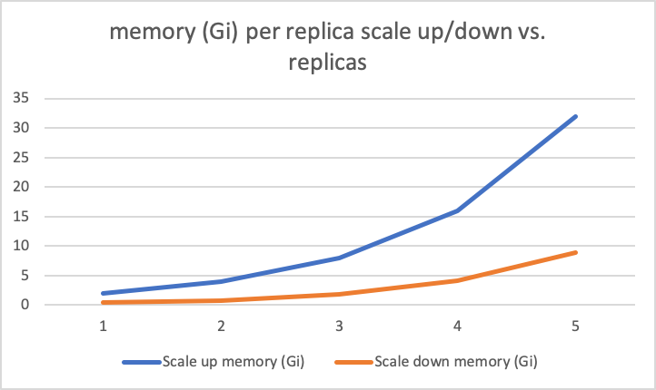

The same information can be visualized in terms of total resources vs. replicas.

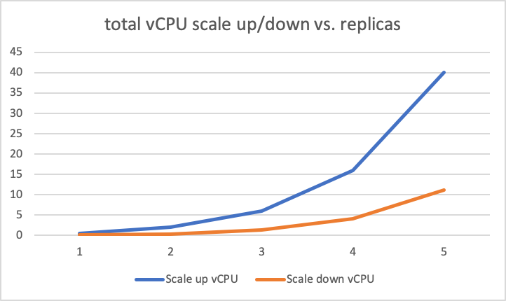
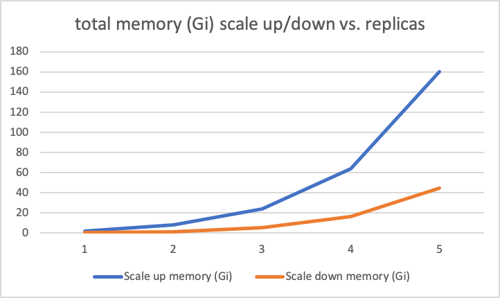

This approach has the advantage that `ScalingIntervalsOverlap` needs to be configured only once which will be applicable to all [effective scaling intervals](#effective-scaling-intervals).
The disadvantage is that it is not flexible enough to allow for the overlap to be configured differently for different effective scaling intervals.

##### `ScaleDownMinResource`

Alternatively, the scaling interval gap could be explicitly configured per [effective scaling interval](#effective-scaling-interval) as an absolute value as `scaleDownMinResource`.

Replicas|Scale up max vCPU per pod|Scale down max vCPU per pod|Scale up max memory (Gi) per pod|Scale down max memory (Gi) per pod|Scale up max total vCPU|Scale down max total vCPU|Scale up max total memory (Gi)|Scale down max total memory (Gi)
---|---|---|---|---|---|---|---|---
1|0.5|0.125|2|0.5|0.5|0.125|2|0.5
2|1|0.25|4|1|2|0.5|8|2
3|2|0.5|8|2|6|1.5|24|6
4|4|1|16|4|16|4|64|16
5|8|2|32|8|40|10|160|40

This leads to the scaling thresholds between replicas that can be visualized as below in terms of resources per replica vs. replicas.

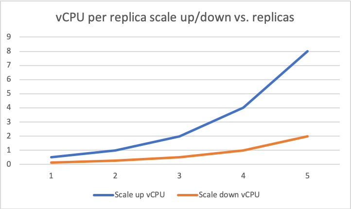
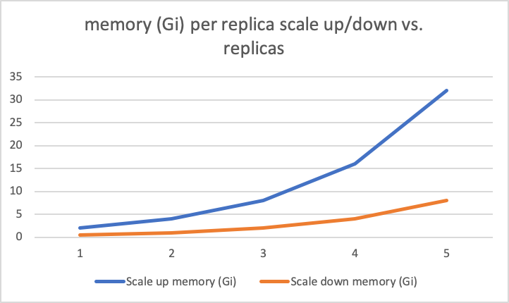

The same information can be visualized in terms of total resources vs. replicas.

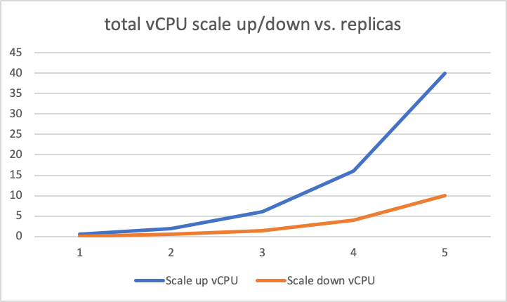
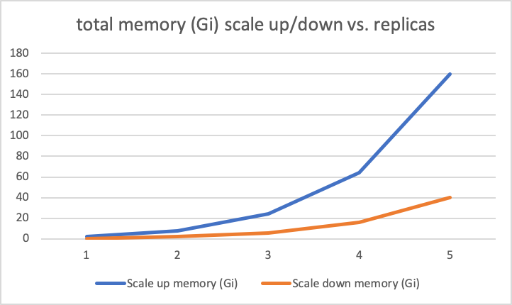

This approach has the advantage that flexible enough to allow for the overlap to be configured differently for different effective scaling intervals.
But the disadvantage is that the overlap needs to be configured separately for each scaling interval.
This is made worse by the fact that the specification might use some short-hand notation to specify scaling intervals such that some them  might have to be extrapolated to individual [effective scaling intervals](#effective-scaling-intervals).
In such a case, there will have to be a separate mechanism to extrapolate the _effective_ `scaleDownMinResource` for the extrapolated effective scaling intervals.

Due to the above complications, [`scalingIntervalsOverlap`](#scalingintervalsoverlap) approach is recommended.

#### VPA Scale-down Efficiency and Responsiveness

This proposal has explicitly proposed [many different kinds](#hysteresis-to-avoid-thrashing-of-scaling-near-the-boundary-between-adjacent-scaling-intervals) of hysteresis between scaling and scaling down behaviour.
In all these cases, the trade-off between stability and cost efficiency has been resolved by erring on the side of stability at the expense of cost efficiency.

This decision has been made with the assumption that VPA can be configured/tuned to be efficient and response in scaling down if the additional resources allocated by the hysteresis behaviour turns out to be not required by the target component for the given workload.

But it is known that VPA (as of [`v0.8.0`](https://github.com/kubernetes/autoscaler/releases/tag/vertical-pod-autoscaler-0.8.0) is not very responsive in scaling down components in timelines smaller than `1d`. The upstream changes done via [VPA PR #2905](https://github.com/kubernetes/autoscaler/pull/2905) would help in tuning VPA accordingly. These changes should be available in VPA releases 0.8.0+.
Note: The global VPA settings would also be applicable for standalone VPAs deployed for other components in the system.

#### Scaling only vertically

Most of this proposal, deals with the case where the target component is to be scaled both vertically and horizontally.
But, with this [approach](#approach), it trivial to see how only vertical scaling can be achieved by specifying a single effective scaling interval with the single `desiredReplicas`.

For example,
Replicas|Max vCPU per pod|Max memory (Gi) per pod|Max total vCPU|Max total memory (Gi)
---|---|---|---|---
2|4|16|16|64

Clearly, this can be combined with horizontal and vertical scaling at other `desiredReplicas`.

#### Scaling only horizontally

As can be seen in most of this proposal, a combination of horizontal and vertical scaling is possible using this [approach](#approach). Only [vertical scaling](#scaling-only-vertically) is also possible. Scaling only horizontally is trickier.

Scaling only horizontally can be achieved by specifying the minimum and maximum [total resource recommendation](#total-resource-recommendation) to be the same for each [effective scaling interval](#effective-scaling-interval) per `desiredReplicas`.

For example,
Replicas|Max vCPU per pod|Max memory (Gi) per pod|Max total vCPU|Max total memory (Gi)
---|---|---|---|---
1|0.5|2|0.5|2
2|0.5|2|1|4
3|0.5|2|1.5|6
4|0.5|2|2|8
5|0.5|2|2.5|10

Careful configuration like this might not be user-friendly and some short-cut specification (say, a `scaleOnlyHorizontally`) flag might be desirable.

In this case, most of the different hysteresis behaviour mentioned [above](#hysteresis-to-avoid-thrashing-of-scaling-near-the-boundary-between-adjacent-scaling-intervals) may not apply.
The only kind of hysteresis that might still make sense to apply is [`minChange`](#minchange).

## Design

Based on the above-mentioned [approach](#approach), the following changes are proposed to the design.

```go
// HvpaSpec defines the desired state of Hvpa
type HvpaSpec struct {
  ...
  // BaseResourcesPerReplica specifies base resources to be budgeted per replica
  // while scaling horizontally
  BaseResourcesPerReplica ResourceChangeParams `json:"baseResourcesPerReplica,omitempty"` 
  // LimitsRequestsGapScaleParams is the scaling thresholds for limits
  // in terms of total resource
  LimitsRequestsGapScaleParams ResourceChangeParams `json:"limitsRequestsGapScaleParams,omitempty"`
  // ScaleUp defines the parameters for scale up in terms of total resource
  ScaleUp ScaleType `json:"scaleUp,omitempty"`
  // ScaleDown defines the parameters for scale down in terms of total resource
  ScaleDown ScaleType `json:"scaleDown,omitempty"`
  // ScalingIntervals indirectly define potentially multiple intervals in total
  // resources for each of which there is a corresponding well-defined single desired 
  // `replicas` value.
  // The intervals are expected not to have gaps and any overlap is determinied by
  // explicit ScalingIntervalsOverlap configuration or any other implicit form of
  // hysteresis.
  ScalingIntervals []ScalingInterval `json:"scalingIntervals,omitempty"`
  // ScalingIntervalsOverlap is used to compute the effective 
  ScalingIntervalsOverlap ResourceChangeParams `json:"scalingIntervalsOverlap,omitempty"`
  ...
}


// ResourceChangeParams specifies resource-wise ChangeParams
type ResourceChangeParams map[corev1.ResourceName]ChangeParams

// ScalingInterval indirectly defines potentially multiple intervals in total
// resources for each of which there is a corresponding well-defined single desired 
// `replicas` value.
type ScalingInterval struct {
	// If this field is not provided, it will default to maxReplicas of HPA
	// +optional
  MaxReplicas int32 `json:"maxReplicas,omitempty"`
  // If this field is not provided, it will default to the maxAllowed of VPA
  // +optional
  MaxResources corev1.ResourceList `json:"maxResources,omitempty"`
  // If this interval defines multiple effective scaling intervals then this field 
  // defined how to compute multiple effective scaling intervals from the total 
  // resource interval defined by this interval.
  // +optional
  EffectiveIntervalExtrapolation *EffectiveIntervalExtrapolationType `json:"effectiveIntervalExtrapolation,omitempty"`
}

type EffectiveIntervalExtrapolationType string

const (
  // Linearly divide the specified wider scaling interval into effective scaling
  // intervals per replica possible by dividing the range of the total resources
  // specified in the interval linearly (equally) among each possible replica.
  EffectiveIntervalExtrapolicationLinear = "linear"
  // Special case of `linear` extrapolation which also indicates that only
  // horizontal scaling is to be done using the computed `EffectiveScalingInterval`s.
  EffectiveIntervalExtrapolicationHorizontalOnly = "horizontalOnly"
)

// EffectiveScalingInterval explicitly defines a single effective scaling interval
// with a fixed single desired `replicas` value and the corresponding allowed range 
// (maximum while scaling up and minimum while scaling down) for total as well as 
// per-pod resources for the given desired `replicas`.
type EffectiveScalingInterval struct {
  // The desired replicas for this effective scaling interval
  Replicas int32
  // Applicable while scaling down
  MinResources corev1.ResourceList
  // Applicable while scaling up
  MaxResources corev1.ResourceList
}
```

The design proposes a single scaling intervals specification per HVPA resource even though the target pods might contain multiple container and resources which might have to scale.
While scaling, for each recommendation source, for container and for each resource, the desired replicas are computed based on the scaling interval specification and the highest value among the computed desired replicas is used with the other vertical scaling values correspondingly adjusted.

### Replace the field `WeightBasedScalingInterval` with `ScalingInterval`

The field [`WeightBasedScalingIntervals`](https://github.com/gardener/hvpa-controller/blob/a797cc095c83a8415290cf7ec3319ee31c4078fd/api/v1alpha1/hvpa_types.go#L216) in [`HVPASpec`](https://github.com/gardener/hvpa-controller/blob/a797cc095c83a8415290cf7ec3319ee31c4078fd/api/v1alpha1/hvpa_types.go#L203-L224) (and the structure [`WeightBasedScalingInterval`](https://github.com/gardener/hvpa-controller/blob/master/api/v1alpha1/hvpa_types.go#L89-L103) it is based on) will be replaced by a new field `ScalingIntervals` based on a new type `ScalingInterval`.

The individual `ScalingInterval` elements of `ScalingIntervals` are expected and validated to be adjacent contiguous intervals in total resources with no gaps in between.
The minimum resources are computed automatically based on the maximum resources of the preceding `ScalingInterval`, `ScalingIntervalsOverlap` and `minAllowed` VPA configuration.

A single `ScalingInterval` may define a single distinct range in total resource for which there is a corresponding single desired `replicas` value (in which case it defines an `EffectiveScalingInterval`).

A single `ScalingInterval` could also represent a series of adjacent contiguous `EffectiveScalingInterval`s which could be extrapolated using the specified `EffectiveScalingIntervalType`.
This is purely for the convenience of the user. HVPA will compute the series of `EffectiveScalingInteval`s for the whole scaling range of the total resources of the target component and will compute and apply the scaling based on only the `EffectiveScalingInterval`s.

### Move `LimitsRequestsGapScaleParams` from `VPASpec` into `HVPASpec`

Based on the approach mentioned [above](#limitsrequestsgapscaleparams), `LimitsRequestsGapScaleParams` is now moved from [`VPASpec`](https://github.com/gardener/hvpa-controller/blob/a797cc095c83a8415290cf7ec3319ee31c4078fd/api/v1alpha1/hvpa_types.go#L128) into the [`HVPASpec`](#design).

### Move `ScaleUp` and `ScaleDown` from `HPASpec` and `VPASpec` into `HVPASpec`

Based on the approach mentioned [above](#scaletype), `ScaleUp` and `ScaleDown` fields are now moved from [`HPASpec`](https://github.com/gardener/hvpa-controller/blob/a797cc095c83a8415290cf7ec3319ee31c4078fd/api/v1alpha1/hvpa_types.go#L192-L196) and [`VPASpec`](https://github.com/gardener/hvpa-controller/blob/a797cc095c83a8415290cf7ec3319ee31c4078fd/api/v1alpha1/hvpa_types.go#L117-L121) to the [`HVPASpec`](#design).

### Introduce `ScalingIntervalsOverlap`

Based on the approach mentioned [above](#scalingintervalsoverlap), [`ScalingIntervalsOverlap`](#design) has been introduced to help compute the minimum resources for the `EffectiveScalingInterval`s.

### `EffectiveScalingInterval`

`EffectiveScalingInterval`s are adjacent [effective scaling intervals](#effective-scaling-interval) which define a unique range in total resources for which there is a single desirable `replicas` value.
These are computed based on the approach mentioned [above](#approach).
Any overlap between `EffectiveScalingIntervals` are computed based on [`ScalingIntervalsOverlap`](#scalingintervalsoverlap).

The scaling is done based on the computed `EffectiveScalingInterval`s and _not_ based on the specified [`ScalingIntervals`](#replace-the-field-weightbasedscalinginterval-with-scalinginterval).

### Introduce `BaseResourcesPerReplica`

Based on the approach mentioned [above](#use-explicitly-specified-base-resource-usage-in-the-calculations), [`BaseResourcesPerReplica`](#design) has been introduced to budget to the [base resource usage](#base-resource-usage-per-replica) in each replica while scaling horizontally between different [`EffectiveScalingInterval`s](#effectivescalinginterval).
This is not effective while scaling vertically within an `EffectiveScalingInterval`.

### Example

With this [design](#design), the [above](#scalingintervalsoverlap) example can be specified as below.

```yaml
...
kind: Hvpa
...
spec:
  ...
   baseResourcesPerReplica:
     cpu:
       value: 50m
       percentage: 5
     memory:
       value: 200M
       percentate: 10
   ...
   scalingIntervals:
   - maxReplicas: 1
     maxResources:
       cpu: 500m
       memory: 2Gi
   - maxReplicas: 2
     maxResources:
       cpu: 1
       memory: 4Gi
   - maxReplicas: 3
     maxResources:
       cpu: 2
       memory: 8Gi
   - maxReplicas: 4
     maxResources:
       cpu: 4
       memory: 16Gi
   - maxReplicas: 5
     maxResources:
       cpu: 8
       memory: 32Gi
   scalingIntervalsOverlap:
     cpu:
       value: 250m
       percentage: 30
     memory:
       value: 1.5Gi
       percentate: 30
  ...
...
```

### Limitations

This design has some limitations which are listed below.

#### Single scaling intervals specification

The design [above](#design) proposes a single scaling intervals specification per HVPA resource even though the target pods might contain multiple container and resources which might have to scale.
The ideal desired scaling intervals for different containers and resources in the target pods might be different.
A single set of scaling intervals, forces the user to choose the scaling intervals in a way that suites only some of the containers/resources and potentially unsuitable for others.

Alternatively, the design might be changed to allow specifying scaling intervals per container per resource.
This would mitigate this particular limitation.

However, there is a general limitation inherent in the problem scape that only one desired replicas can be chosen at any point in time.
So, despite separate scaling interval definition per container per resource, at any point in time, they might specify conflicting desired replicas.
The approach [above](#approach) has [consistently](#multiple-sources) suggested using the [maximum](#multiple-resources) of the suggested desired replicas and adjusting the remaining scaling accordingly.
This would still result in optimal scaling for only some of the containers/resources and sub-optimal scaling for others.

Given these issues, the design sticks to a single scaling intervals specifications.

This limitation becomes unimportant in single container pods, multiple container pods with one main container and other smaller containers or multiple main containers but only one of which scales significantly with load with the others remaining relatively stable in scale.

This limitation becomes an important one when there are multiple container pods with more than one of them scaling significantly with load yet scale differently with load.

### Implementation Priority

- Higher priority for implementation of this proposal would be the algorithm changes based on [`EffectiveScalingInterval`s](#effectivescalinginterval) which in turn are based on [total resource recommendation](#total-resource-recommendation).
  - This could be implemented without any support for [`EffectiveIntervalExtrapolicationType`](#design). I.e. users could specify the `EffectiveScalingInterval`s explicitly by specifying `ScalingIntervals` with one element for each desirable `replicas` value.
- The support for short-hand specification using different values for `EffectiveIntervalExtrapolicationType` (including `EffectiveIntervalExtrapolicationLinear`, `EffectiveIntervalExtrapolicationHorizontalOnly` and possibly others like `EffectiveIntervalExtrapolicationLogarithmic` and `EffectiveIntervalExtrapolicationExponential`) could be done incrementally in the future.

## Alternatives

The alternatives are discussed inline in the [motivation](#motivation) and the [approach](#approach) in the context of the problems they eligible to solve.
